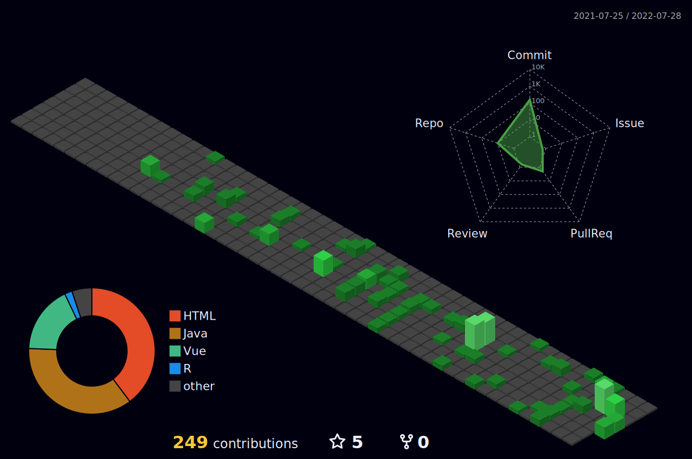

## Hi,

- 📌 my name is Leon and I'm 22 years old
- 👨🏻‍🎓 I'm currently studying Business Computing at the HTW University of Applied Sciences Berlin
- 🌱 I’m currently learning JavaScript and Vue.js
- 📫 How to reach me: leonkorth@icloud.com

<!--

r-->

## Github Stats:

## Tech Stack:

